<div align="center">
  <h1>📚 Modern Library Management System (LMS)</h1>
  <p>A premium, web-based Library Management System built with ASP.NET Core MVC and a bespoke modern design system.</p>

  <p>
    
    
    
    
    
    
    
    
    <br>
    
    
    
    
    
  </p>
</div>

---

## 🚀 Project Overview

The **Modern Library Management System (LMS)** is a comprehensive, enterprise-grade web application designed to automate and simplify everyday library operations. Built on a robust **ASP.NET Core MVC** architecture, it provides an intuitive, high-performance interface for managing books, tracking student borrowing, and maintaining digital records of periodicals.

Recently overhauled with a **premium, redesigned UI**, this platform delivers a seamless, SaaS-style user experience. Featuring responsive layouts, an interactive analytics dashboard, a modern landing page, and role-based management, the system is fully equipped to handle realistic scale with a high-quality seeded dataset.

---

## ⭐ Project Highlights

- **Premium Modern Responsive UI:** A bespoke design system with fluid animations and glassmorphism.
- **Interactive Analytics Dashboard:** Real-time metrics powered by Chart.js.
- **Complete Library Management Workflow:** End-to-end management of books, periodicals, and circulation.
- **Role-Based Authentication:** Secure access control for Admins, Librarians, and Students.
- **Realistic Seeded Database:** Pre-populated with over 5,000 records for robust demonstration and testing.
- **Advanced Reports:** Comprehensive insights into library operations and financials.
- **Search & Filtering:** Fast, efficient data retrieval across massive datasets.
- **Responsive Design:** Optimized for desktop, tablet, and mobile devices.
- **Professional Code Organization:** Clean MVC architecture following best practices.
- **Entity Framework Code First:** Seamless database migrations and strongly typed data access.

---

## 📸 Screenshots

*(Images are located in the `docs/screenshots/` directory)*

### Landing Page
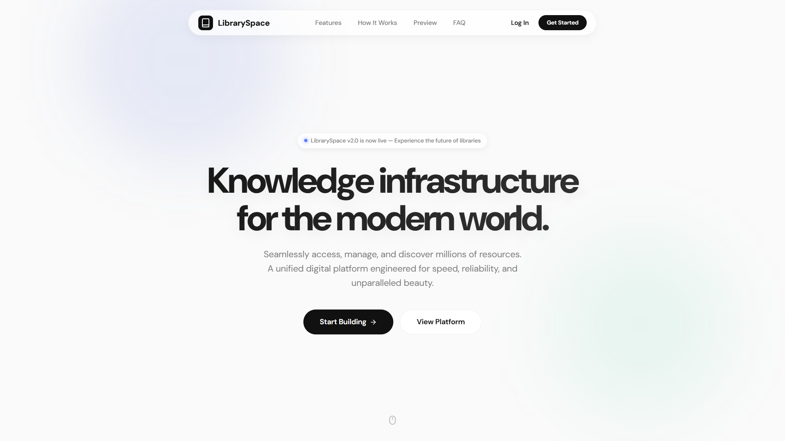

### Dashboard
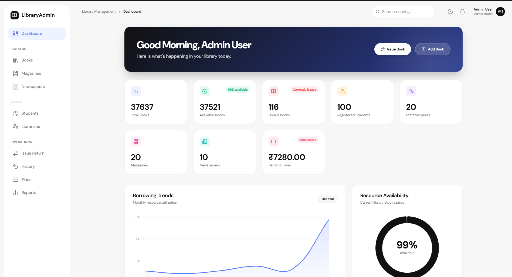

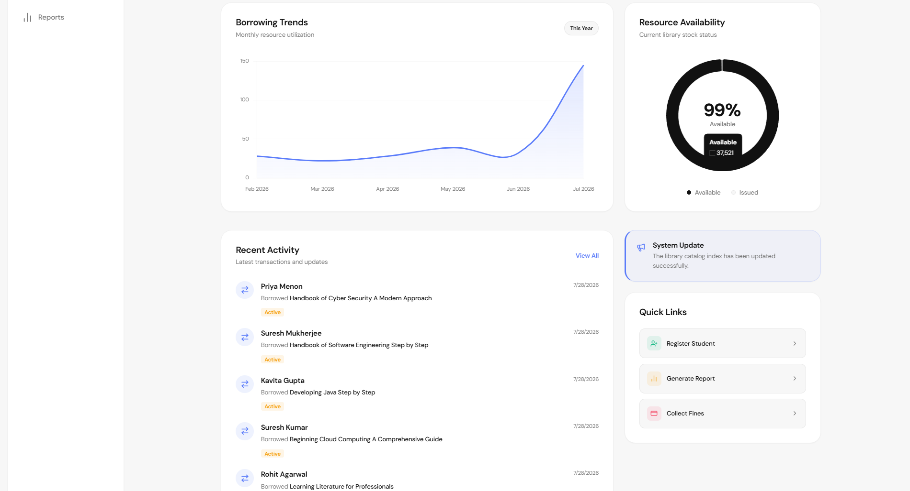


### Login
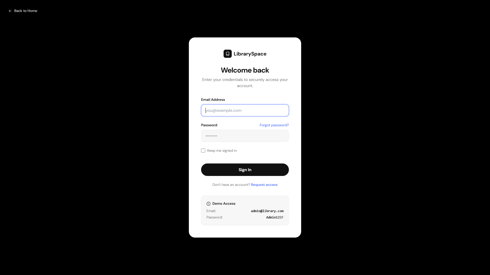

### Register
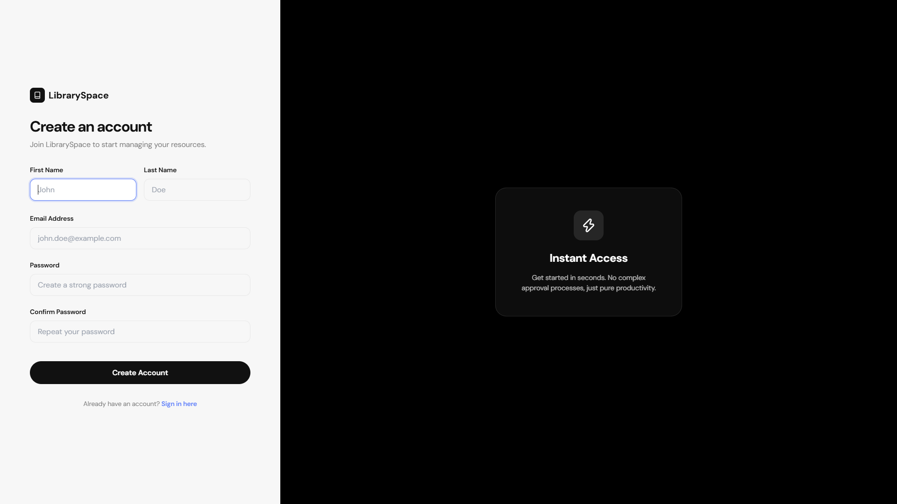

### Books


### Students


### Librarians
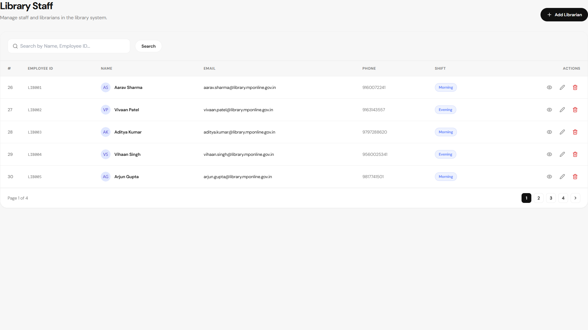

### Borrow
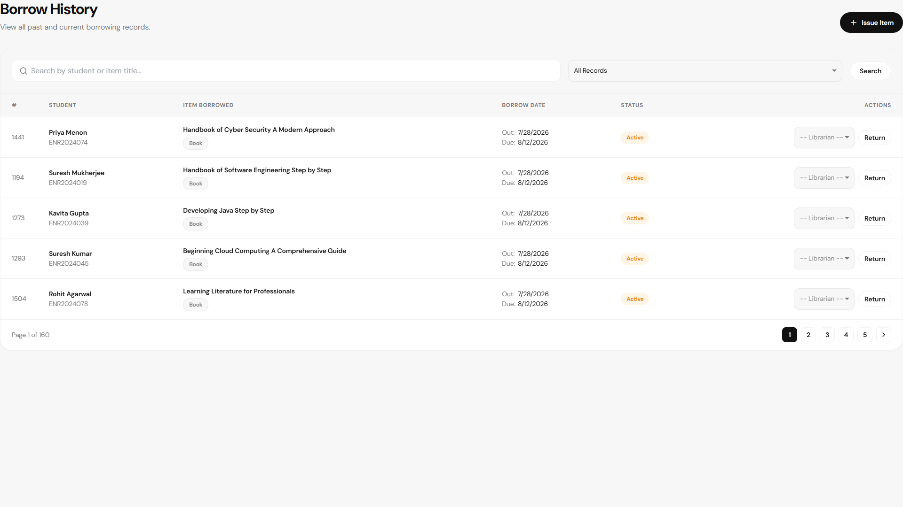

### Reports


### Magazines
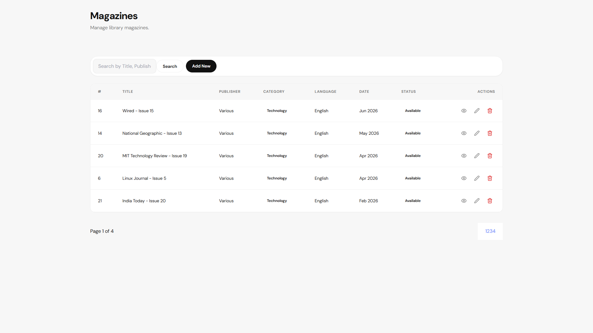

### Newspapers
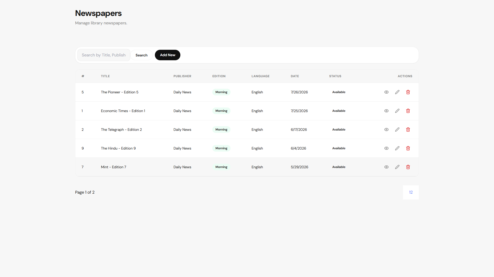

### Search


### Publications
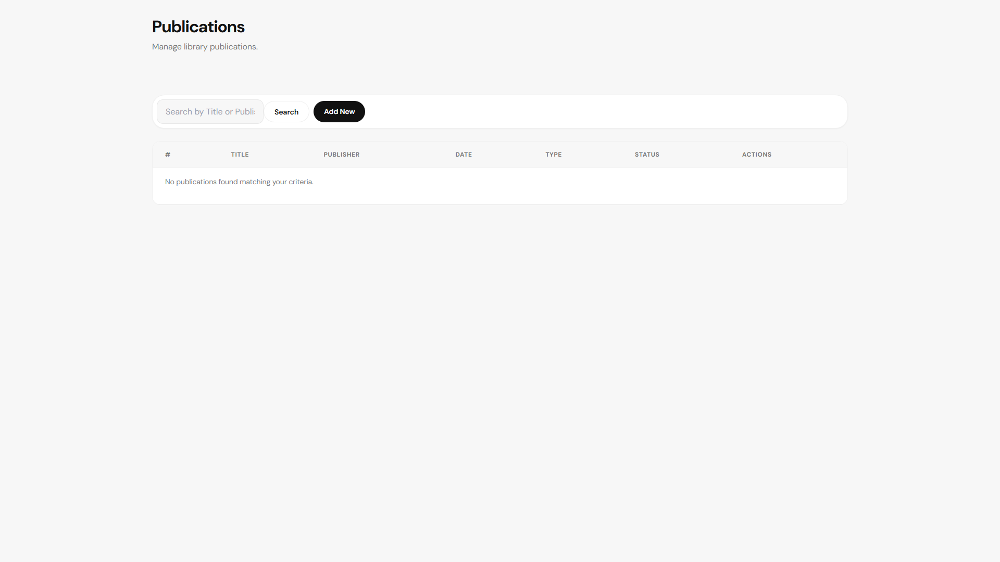

---

## 🎨 Modern UI Improvements

The project has recently undergone a massive visual overhaul to match modern web standards:
- **Premium Landing Page:** Redesigned with smooth scroll animations, dynamic statistics, and a sleek browser mockup.
- **Completely Redesigned Dashboard:** Glassmorphism aesthetics, soft shadows, and refined chart integrations.
- **Better Typography:** Implementation of modern sans-serif fonts optimized for readability and visual hierarchy.
- **Responsive Layouts:** A fluid grid system ensuring perfect display across all screen sizes.
- **Better Cards:** Upgraded data presentation with unified spacing and hover-lift effects.
- **Better Forms:** Beautifully styled inputs with real-time validation and a dark-themed authentication flow.
- **Better Tables:** Clean, easily scannable data grids featuring ghost button actions.
- **Better Navigation:** A floating, capsule-style navigation bar.
- **Hover & Scroll Animations:** Custom `IntersectionObserver` logic for elegant section reveals and micro-interactions.
- **Modern Design System:** Transitioned from generic frameworks to a bespoke CSS variables architecture.
- **Improved Accessibility:** Higher contrast ratios and clear visual indicators.

---

## 💻 Technology Stack

### Backend
- ASP.NET Core MVC (.NET 8)
- Entity Framework Core
- SQL Server
- C#

### Frontend
- HTML5
- CSS3 (Bespoke Design System)
- Bootstrap
- JavaScript
- Lucide Icons
- Responsive Design

### Development Tools
- Visual Studio
- Git
- GitHub

---

## 🏛️ Architecture

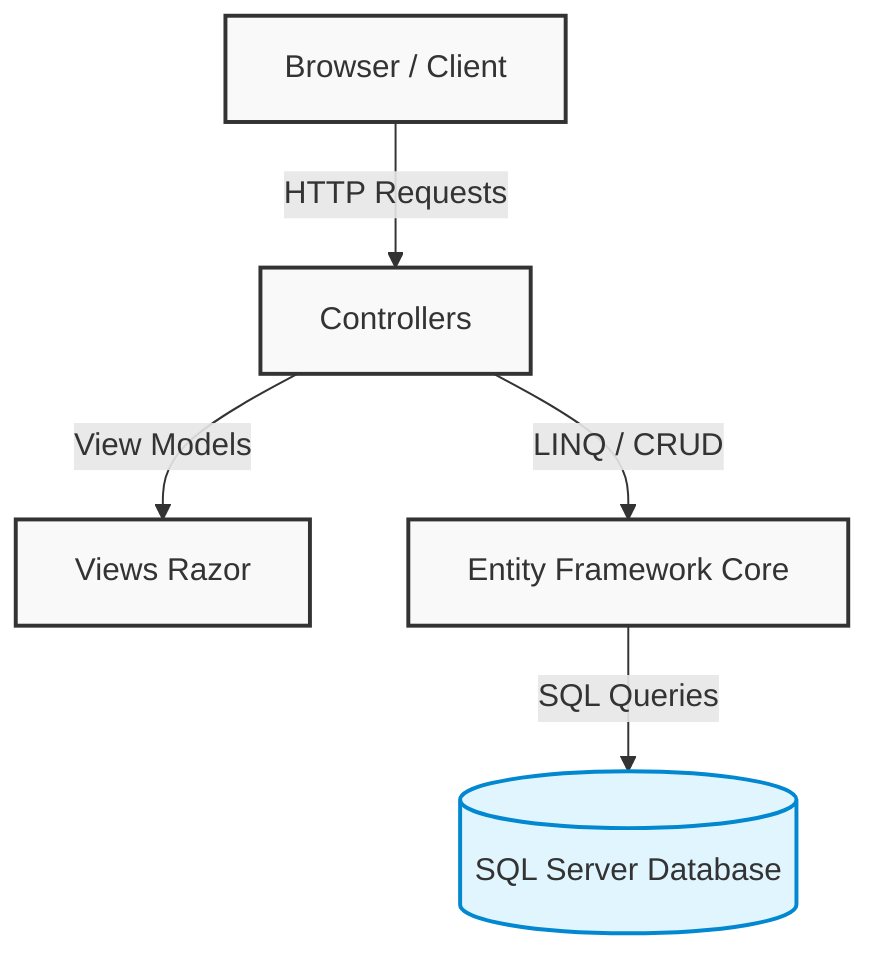

---

## 🗄️ Database Diagram

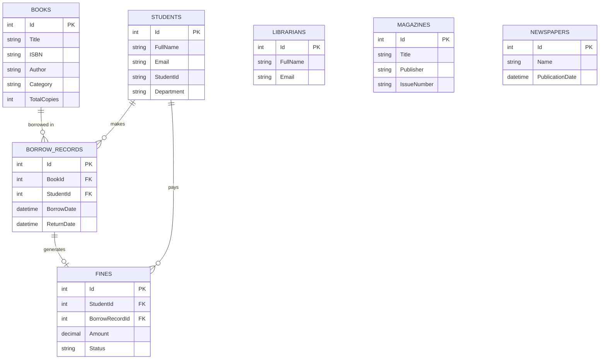

---

## 📁 Project Structure

```text
LibraryManagement.MVC/
│
├── Controllers/       # Handles incoming HTTP requests & routing
├── Models/            # Domain entities mapped to database tables
├── ViewModels/        # Specialized DTOs for tailored UI data passing
├── Views/             # Razor pages forming the user interface
├── Services/          # Business logic and external API integrations
├── wwwroot/           # Static web assets (CSS, JS, Images, Icons)
│   ├── css/styles/    # Custom CSS variables and component styles
│   └── docs/screenshots/ # High-quality UI screenshots
├── Database/          # Entity Framework migrations
├── appsettings.json   # Configuration & database connection strings
├── DbSeeder.cs        # Logic for generating realistic sample datasets
└── Program.cs         # App entry point & dependency injection container
```

---

## 🛠️ Installation

### Prerequisites
- .NET 8.0 SDK
- Visual Studio 2022 (recommended) or VS Code
- SQL Server (Express or Developer Edition)

### Setup Instructions

1. **Clone the repository:**
   ```bash
   git clone https://github.com/Aditya4860/LMS.git
   cd LMS
   ```

2. **Restore Packages:**
   Open the solution in Visual Studio to automatically restore NuGet packages, or run:
   ```bash
   dotnet restore
   ```

3. **Database Setup:**
   Open `appsettings.json` in the `LibraryManagement.MVC` project and ensure the `DefaultConnection` string points to your local SQL Server instance.

4. **Run Migrations & Seed Data:**
   Use the Package Manager Console in Visual Studio (`Update-Database`) or the .NET CLI:
   ```bash
   dotnet ef database update --project LibraryManagement.MVC
   ```

5. **Run the Application:**
   Press `F5` in Visual Studio or use the CLI:
   ```bash
   dotnet run --project LibraryManagement.MVC
   ```

### Default Credentials
Use these demo accounts to explore the role-based features of the application:
- **Administrator:** `admin@libraryspace.com` | `Password123!`
- **Librarian:** `librarian@libraryspace.com` | `Password123!`
- **Student:** `student@libraryspace.com` | `Password123!`

---

## 📦 Sample Data

To provide a robust demonstration of performance, pagination, and analytics, the system includes a realistic seeded database.

Approximately:
- **5,000** Books (Valid ISBNs, Categorized)
- **100** Students (Realistic profiles across departments)
- **15–20** Librarians
- **20** Magazines
- **10** Newspapers
- **600–800** Borrow Records
- **150** Fine Records (including 15 Pending Fines)

*Note: This sample data is automatically generated during the initial database migration for demonstration purposes.*

---

## 🗺️ Roadmap

Future enhancements planned for the platform:
- [ ] **QR Code Borrowing:** Instant book checkout via mobile scanning.
- [ ] **Barcode Scanner Integration:** Streamlined hardware support for librarians.
- [ ] **Email Notifications:** Automated due date reminders and fine alerts.
- [ ] **Cloud Deployment:** CI/CD pipeline for Azure or AWS hosting.
- [ ] **PWA Support:** Installable Progressive Web App functionality.
- [ ] **AI Book Recommendation:** Suggesting books based on student borrowing history.
- [ ] **Dark Mode:** System-wide dark theme toggle.
- [ ] **Mobile Application:** Dedicated native app for students.

---

## 🤝 Contributing

Contributions are welcome! To contribute to this project:

1. **Fork** the repository
2. **Branch** off main (`git checkout -b feature/AmazingFeature`)
3. **Commit** your changes (`git commit -m 'Add some AmazingFeature'`)
4. **Push** to the branch (`git push origin feature/AmazingFeature`)
5. **Pull Request** to merge your feature

---

## 📄 License

This project is licensed under the [MIT License](LICENSE). 
[](https://opensource.org/licenses/MIT)


---
<div align="center">
  <i>Developed and designed with ❤️</i><br>
  <i>If you found this project helpful, please consider giving it a ⭐️!</i>
</div>
